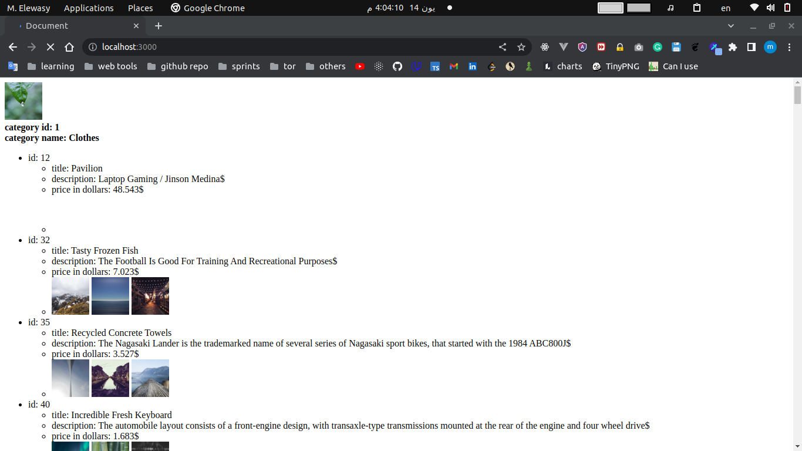
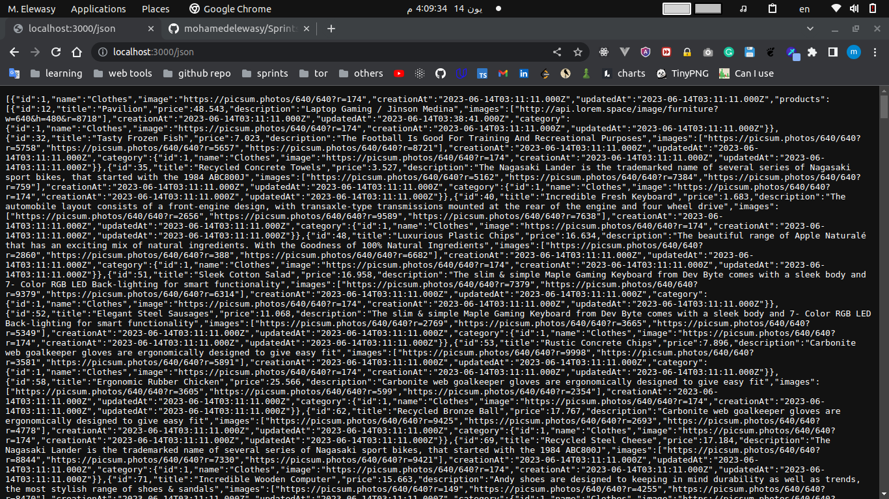

#installation instruction
* clone this repo
* cd Sprints-Tasks/NODE_2
* npm install
* npm start
* `http://localhost:3000` for data presented as screenshot-1
* `http://localhost:3000/json` for json format as screenshot-2

screenshot-1

screenshot-2
